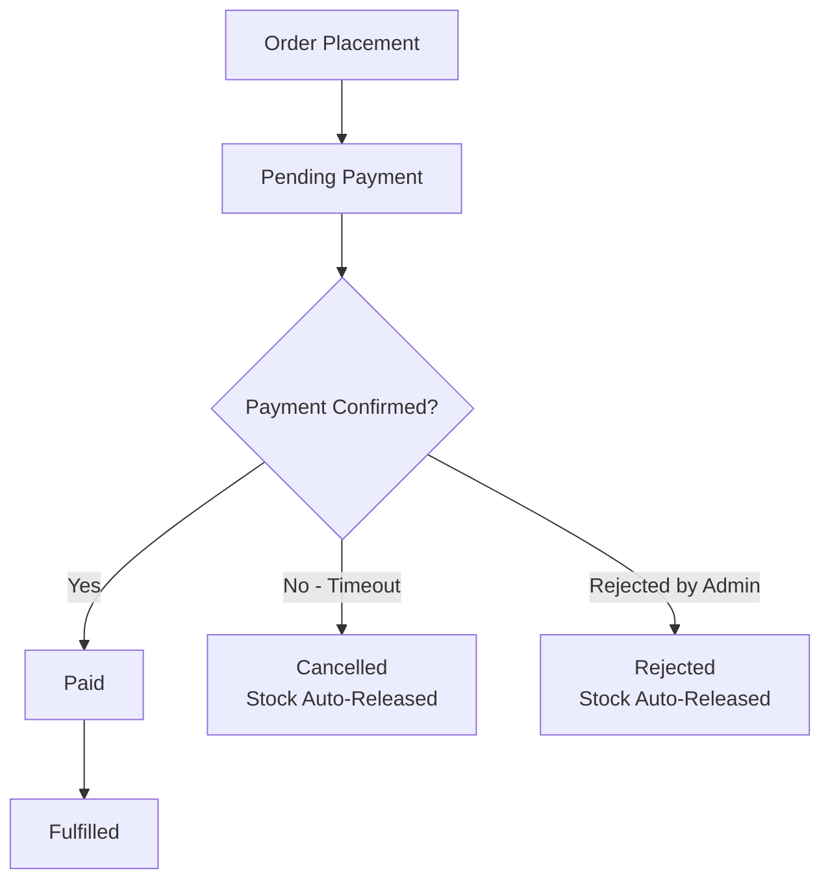

# StockFlow Demo - Order & Inventory Management

Demo application showcasing the order lifecycle with stock reservation, payment SLA, automatic stock release, and invoice fulfillment.

## Live Staging

| Service | URL |
|---------|-----|
| Frontend | https://demo.rachmat.pro |
| API | https://api.demo.rachmat.pro |
| API Docs (Rswag) | https://api.demo.rachmat.pro/api-docs |
| Solid Queue Dashboard | https://api.demo.rachmat.pro/mission_control/jobs |
| Mailpit (Email Inspector) | https://mailpit.rachmat.pro |

## Demo Accounts

| Account | Email |
|---------|-------|
| Buyer | buyer@example.test |
| Admin | admin@tiba.local |

To log in, visit the frontend and click "Forgot PIN". The system sends a Login PIN email to the account's email address. Open https://mailpit.rachmat.pro and inspect the latest email for that recipient — the PIN is included in the body.

## Outgoing Emails

All outgoing emails are captured by Mailpit instead of being sent to real recipients:

- No emails are sent to real recipients
- All outgoing emails can be inspected at https://mailpit.rachmat.pro
- Raw headers, HTML source, and body of every email are available

### Email types sent by the system

| Trigger | Email | Recipient |
|---------|-------|-----------|
| Order created | Invoice | Buyer |
| Payment due (1 day before SLA) | Payment Reminder | Buyer |
| Payment confirmed | Paid Confirmation | Buyer |
| Payment expired | Cancelled Notification | Buyer |
| Payment rejected (admin) | Rejected Notification | Buyer |
| Admin verifies/rejects payment | Admin Notification | ops@stockflow-demo.id |
| User registers | Welcome + Login PIN | New user |
| User forgets PIN | Login PIN resend | Existing user |

## Order Lifecycle



### Step-by-step flow

1. **Order Placement** -- Buyer selects products and quantity. System checks warehouse stock availability before creating the order.

2. **Stock Reservation & Billing** -- Available stock is locked (reserved) so other buyers cannot claim it. Invoice is generated with payment SLA (deadline).

3. **Payment Verification** -- Buyer uploads proof of payment via available channels. Admin verifies via dashboard. On confirmation, order becomes `Paid` and reserved stock is permanently deducted.

4. **Automatic Stock Release** -- If payment deadline passes without confirmation, status becomes `Cancelled` and reserved stock is automatically returned to the warehouse.

5. **Fulfillment & Notifications** -- Digital invoice/receipt is emailed to the buyer automatically.

## Documentation

- [High-Level Design](docs/high-level-design.md)
- [Multi-User Flow Diagram](docs/multi-user-flow-diagram.md)
- [Stock Reservation Logic](docs/stock-logic.md)
- [Database Schema and Diagram](docs/database-schema-and-diagram.md)

## Project Structure (copied files)

```
app/
  controllers/
    v1/
      orders_controller.rb           # Order placement, payment status checks
      admin/
        payments_controller.rb       # Payment verification, rejection
        stock_movements_controller.rb
  jobs/
    cancel_expired_orders_job.rb     # SLA expiry -> cancel + release stock
    payment_reminder_job.rb          # 1-day-before deadline reminder
  mailers/
    application_mailer.rb
    order_mailer.rb                  # 6 order lifecycle emails
    auth_mailer.rb                   # Welcome + Login PIN
  models/
    order.rb
    order_item.rb
    payment.rb
    stock_movement.rb
  views/
    layouts/
      mailer.html.erb
      mailer.text.erb
    order_mailer/
      invoice_email.html.erb
      reminder_email.html.erb
      paid_email.html.erb
      cancelled_email.html.erb
      rejected_email.html.erb
      admin_notify_email.html.erb
    auth_mailer/
      welcome_email.html.erb
      login_pin_email.html.erb
```
