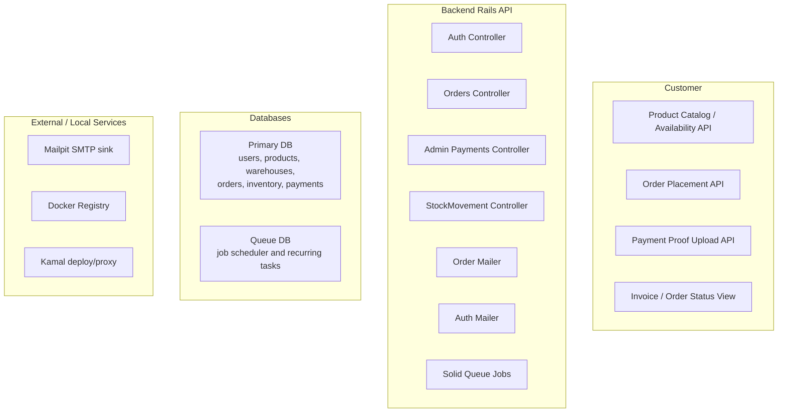
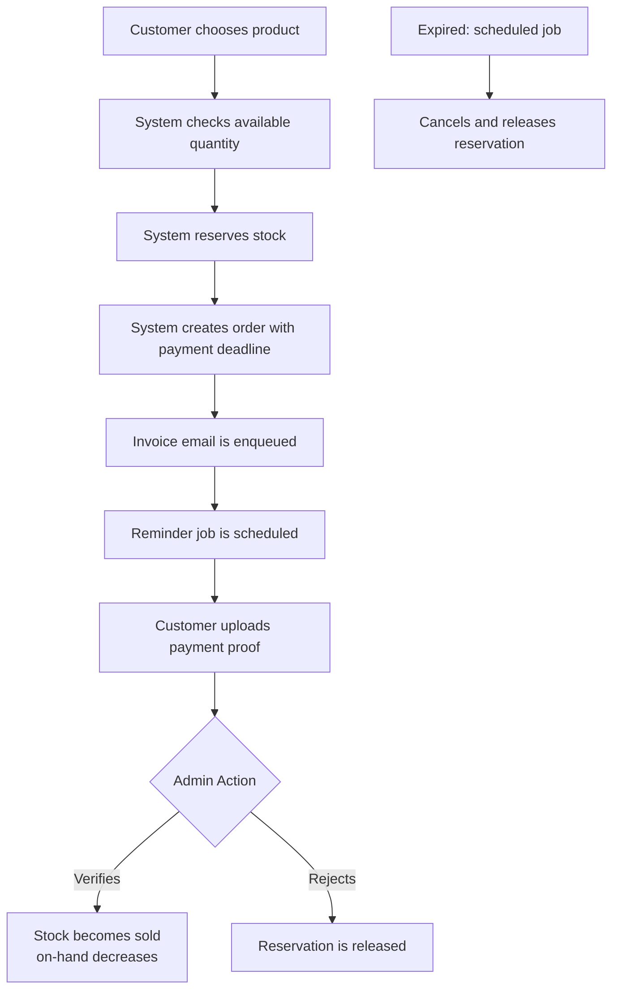

# High-Level Design

## Scope

StockFlow Demo models an order and inventory system where buyers can place orders, reserve stock, submit payment proof, and receive fulfillment notifications. Admins verify or reject payments, while the system automatically cancels expired unpaid orders and releases reserved stock.

## System Goals

1. Prevent overselling by reserving stock at order creation time.
2. Enforce a payment service level agreement.
3. Automatically release stock when payment expires or is rejected.
4. Deduct inventory only after payment verification.
5. Audit every stock movement.
6. Notify buyers and admins through email.

## Primary Users

| Role | Responsibility |
|------|----------------|
| Customer / Buyer | Browse products, check availability, create order, upload payment proof, view order status |
| Admin / Ops | Verify or reject payment, review stock movement, monitor operations |
| System / Scheduler | Send payment reminders, cancel expired orders, release reserved stock |
| Mailpit | Capture staging emails for inspection instead of sending real outbound mail |

## High-Level Components



## Application Flow



## Deployment

Staging is deployed with:

```bash
bin/kamal deploy --destination staging
```

Runtime services:

| Service | Endpoint |
|---------|----------|
| API | https://api.demo.rachmat.pro |
| Frontend | https://demo.rachmat.pro |
| Mailpit | http://100.66.185.79:8025 |
| Queue UI | https://api.demo.rachmat.pro/mission_control/jobs |
