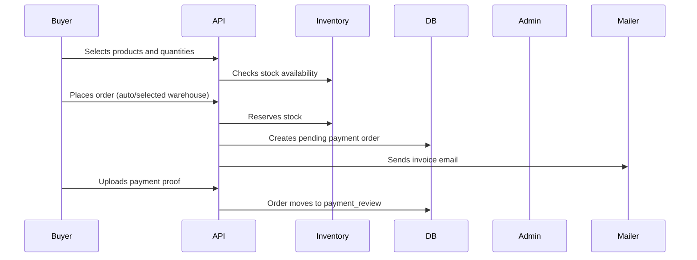
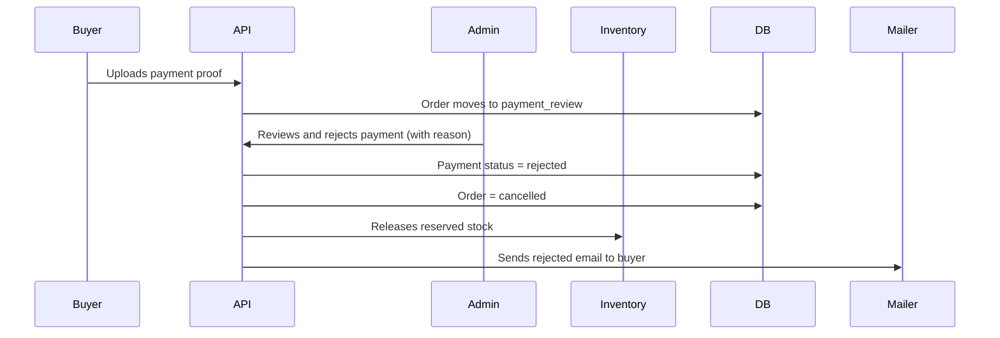
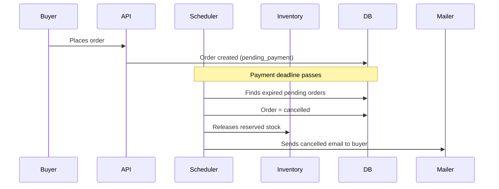
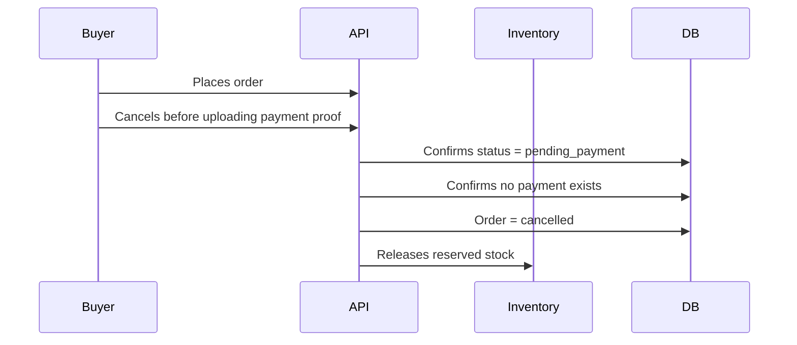
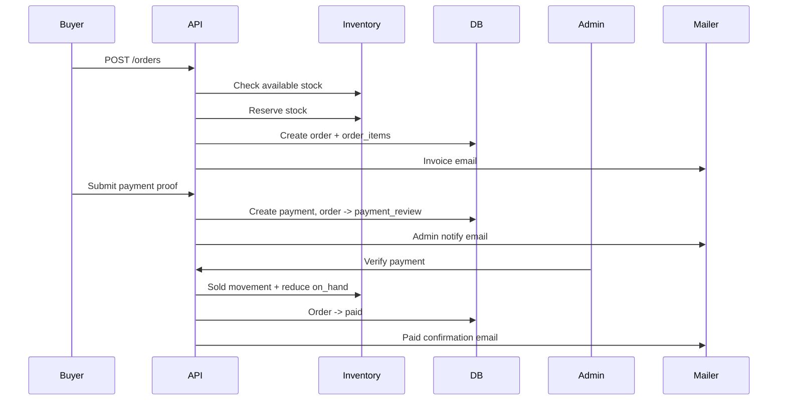
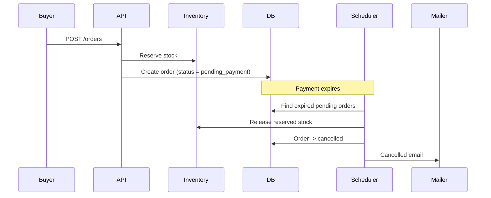
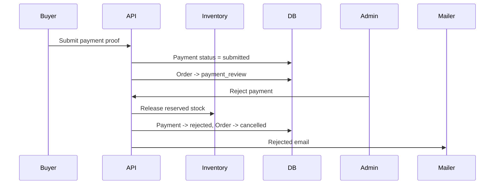
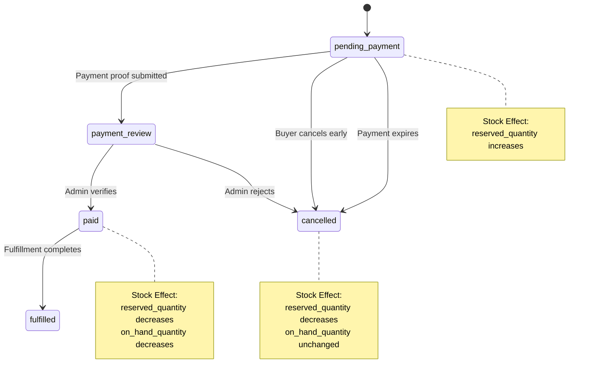

# Multi-User Flow Diagram

## Participants

| Actor | System Name | Example Action |
|-------|-------------|----------------|
| Buyer | Customer | Creates order, uploads payment proof, views invoice |
| Admin | Admin/Ops | Reviews payment, verifies or rejects |
| Scheduler | System Job | Sends reminder, cancels expired unpaid orders |
| Mailpit | Email Sink | Captures notification emails for inspection |

## Main Success Flow

## Rejected Payment Flow

## Expired Payment Flow

## Early Cancellation Flow

## Sequence Diagram - Happy Path

## Sequence Diagram - Expired Order

## Sequence Diagram - Rejected Order

## State Flow

