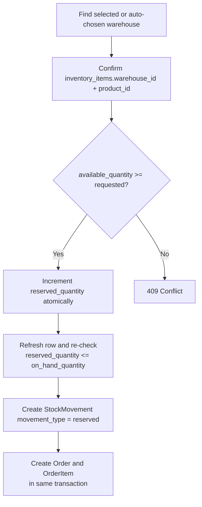
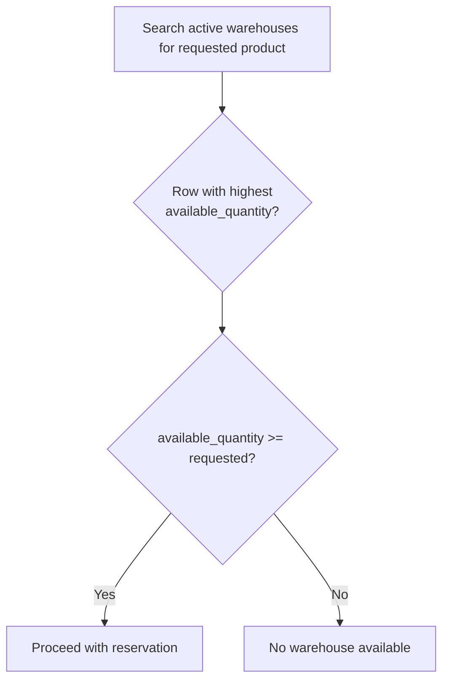
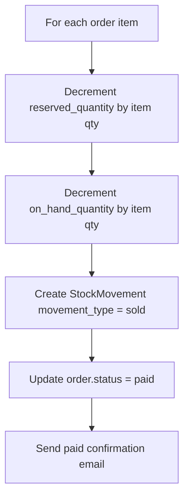
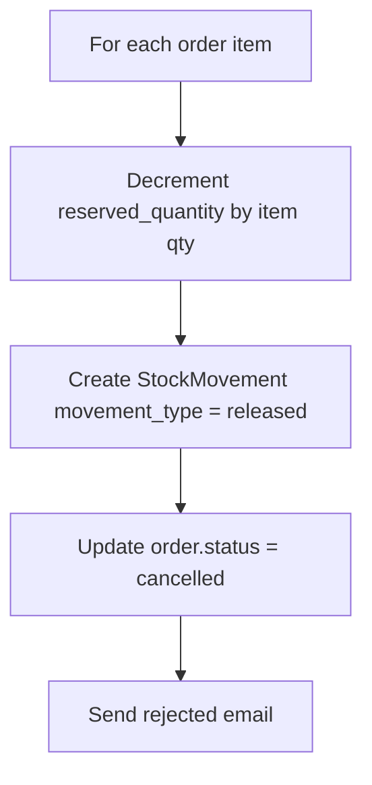
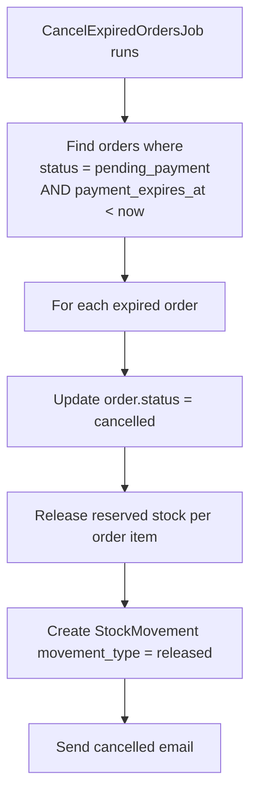
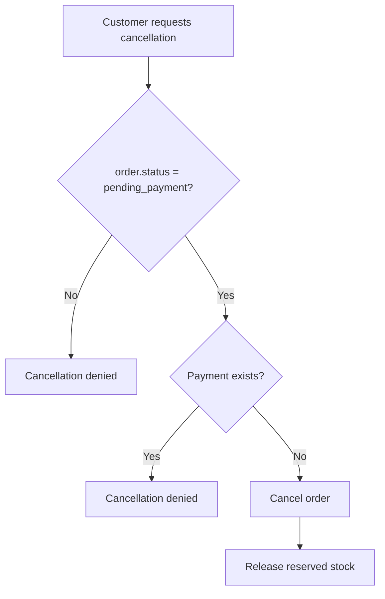

# Stock Reservation Logic

## Stock Concept

Stock is stored per warehouse-product combination in `inventory_items`.

| Field | Meaning |
|-------|---------|
| `on_hand_quantity` | Physical items available in the warehouse |
| `reserved_quantity` | Items currently held for unpaid/reviewed orders |
| `available_quantity` | Calculated as `on_hand_quantity - reserved_quantity` |

Database constraints:

```sql
on_hand_quantity >= 0
reserved_quantity >= 0
reserved_quantity <= on_hand_quantity
```

## Available Quantity

```text
available_quantity = on_hand_quantity - reserved_quantity
```

An order can only reserve stock when:

```text
available_quantity >= requested_quantity
```

## Reservation

When a buyer creates an order:



### Reservation Stock Movement

```text
StockMovement
  movement_type = reserved
  quantity = ordered quantity
  order_id = order id
  idempotency_key = order-specific unique key
```

## Automatic Warehouse Selection

If the buyer uses auto-selection:



## Payment Verification - Stock Sold

When admin verifies payment:



Net stock effect:

```text
reserved_quantity -= qty
on_hand_quantity -= qty
available_quantity stays consistent because both sides decrease by qty
```

## Rejection - Stock Released

When admin rejects payment:



Net stock effect:

```text
reserved_quantity -= qty
on_hand_quantity unchanged
available_quantity increases
```

## Payment Timeout - Stock Released

The recurring job `CancelExpiredOrdersJob` finds:

```text
orders.status = pending_payment
orders.payment_expires_at < now
```

For each expired order:



## Cancellation Before Payment



## Idempotency

Every stock movement has a unique `idempotency_key`. This prevents duplicate reservations, releases, or sales if a request is retried.

Examples:

| Action | Key Pattern |
|--------|-------------|
| Reservation | `idempotency-key-idx` |
| Sold | `sold-payment_id-idx` |
| Rejected | `released-payment_id-idx` |
| Expired | `expired-order_id-idx` |

## Error Handling

| Failure | Action |
|---------|--------|
| Product not found | 404 Not Found |
| Insufficient stock | 409 Conflict |
| Reservation violates constraints | Roll back and return 409 |
| Payment amount less than order total | 422 Unprocessable Entity |
| Payment not in review state | 422 Unprocessable Entity |
| Stock release fails | 422 Unprocessable Entity |
